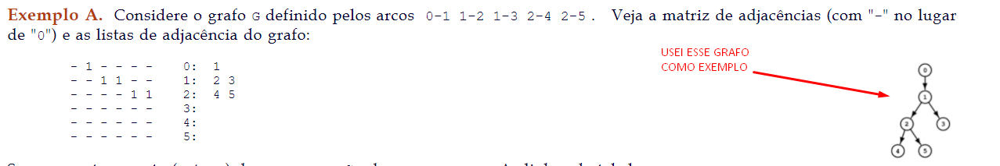
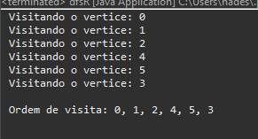

# dfsR
Escreva uma versão iterativa da função dfsR() (https://www.ime.usp.br/~pf/algoritmos_para_grafos/aulas/dfs.html#example-A) para grafos representados por matriz de adjacências.

## BuscaProfundidade
Implementação da Busca em Profundidade.

## O que precisa?
> Java 16

> E excutar o código

Usei esse grafo de exemplo:
<p align="center">
    
</p>

```java
		//Cria o Digrafo 'G' coloque a matriz aqui
		public void criarGrafo() {
			addArestas(0, 1);
			addArestas(1, 2);
			addArestas(1, 3);
			addArestas(2, 4);
			addArestas(2, 5);
```  
### modifiquei aqui o tamanho do grafo

```java
	public static void main(String[] args) {
		
		Grafo grafo = new Grafo(6); // mude o tamanho do grafo aqui, EX: se o criarGrafo() tiver 9 addArestas, coloque 10
		// Grafo grafo = new Grafo(10); // coloque +1 sempre 
		dfsR solucao = new dfsR(grafo);
		solucao.buscaProfundidade();
		

	}
```
# O resultado é esse: 

<p align="center">
    
</p>
